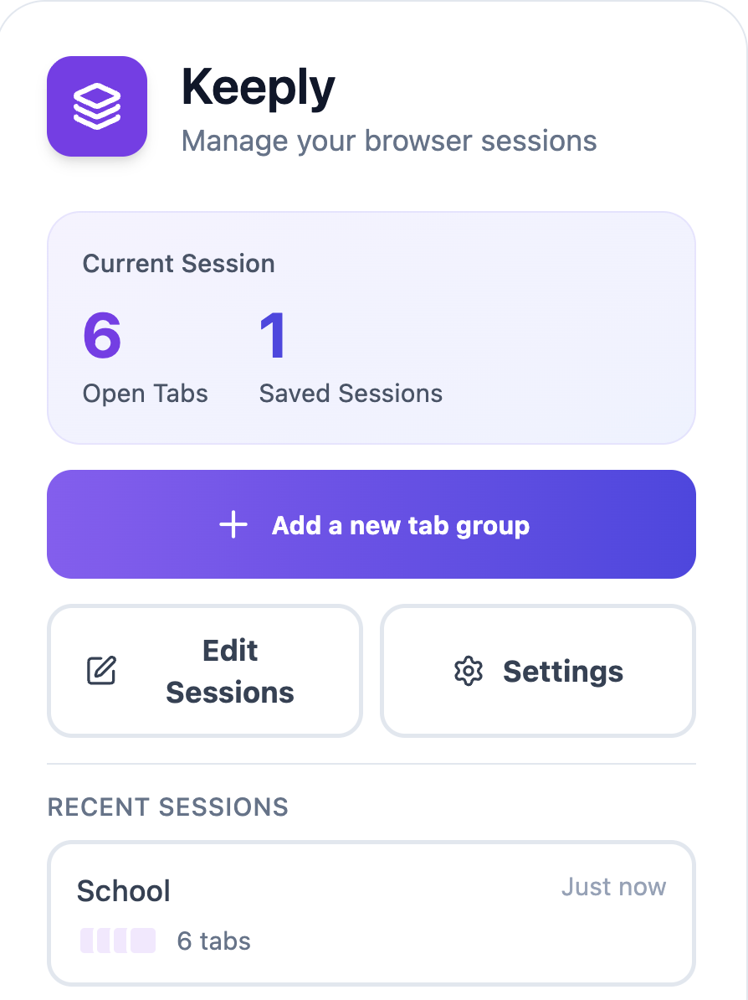
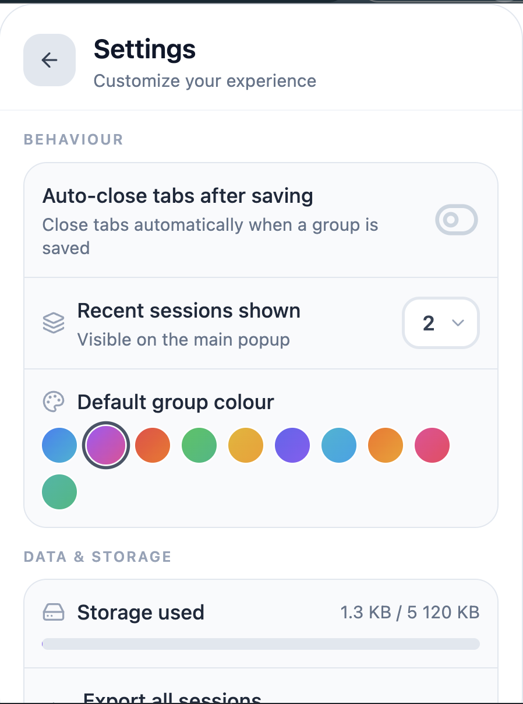
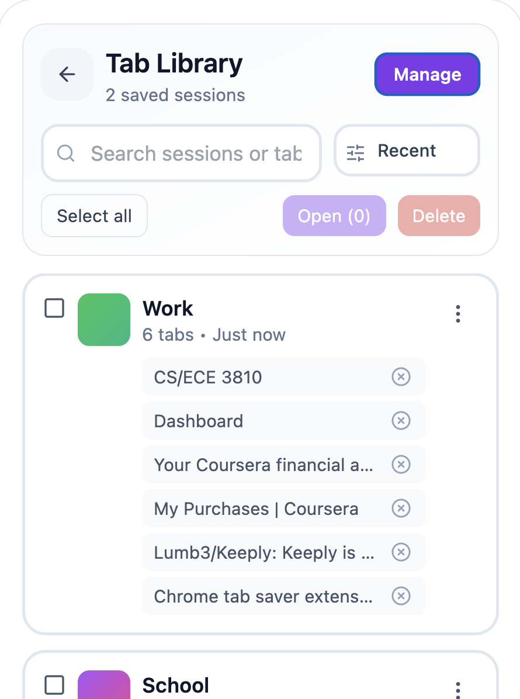

# Keeply

Keeply is a Chrome extension that allows users to save, organize, and restore browser tabs efficiently. Users can group tabs, assign names and colours, and restore them with a single click.

## Features

- Save all open tabs at once into a named group
- Restore saved tab groups quickly
- Organize tabs with custom names and colour labels
- Search and sort saved sessions
- Export and import session backups as JSON
- Auto-close tabs after saving *(configurable)*

## Pages

| Page | Description |
|------|-------------|
| **Popup** (`popup-page.tsx`) | The main landing view. Shows the current open-tab count, total saved sessions, a shortcut to add a new group, and the 3 most recent sessions. |
| **Library** (`library-page.tsx`) | Full list of all saved tab groups. Supports search, sorting (recent / name / tab count), bulk selection, rename, duplicate, colour change, per-tab removal, and JSON export per group. |
| **Add Tab Group** (`addtab-page.tsx`) | Form for saving the current browser tabs into a new named group with a chosen colour. |
| **Settings** (`settings-page.tsx`) | Configure extension behaviour: auto-close tabs after saving, number of recent sessions shown on the popup, default group colour, storage usage indicator, full export/import of all sessions, and a clear-all action. |

## Installation

1. Clone this repository:

   ```bash
   git clone https://github.com/your-username/keeply.git
   ```

2. Install dependencies:

   ```bash
   npm install
   ```

3. Build the extension:

   ```bash
   npm run build
   ```

4. Open Chrome and navigate to `chrome://extensions/`
5. Enable **Developer mode**
6. Click **Load unpacked** and select the `dist/` folder

## Testing

Storage logic is tested with [Vitest](https://vitest.dev/) using a mock `chrome` API so tests run in Node without a real browser.

```bash
npm run test
```

The mock replaces `chrome.storage.local` with an in-memory store, letting the test suite verify all methods in `storage.ts` in isolation:

| Test | What it checks |
|------|----------------|
| `saveTabGroup` | Persists a new group and prepends it to the existing list |
| `getAllTabGroups` | Returns the full list in insertion order |
| `getRecentTabGroups(n)` | Returns only the `n` most recently saved groups |
| `deleteTabGroup` | Removes the correct group by ID and leaves others intact |
| `updateTabGroup` | Replaces the matching group while preserving all others |
| `getTabGroupsCount` | Returns the correct group count as a resolved promise |
| `formatRelativeTime` | Formats timestamps correctly across minutes, hours, days, and older dates |

### Example mock setup

```ts
// vitest.setup.ts
(globalThis as any).chrome = {
  tabs: {
    query: vi.fn(async () => []),
    create: vi.fn(async () => ({ id: 1 })),
    update: vi.fn(async () => ({})),
    onCreated: {
      addListener: vi.fn((cb: () => void) => createdListeners.push(cb)),
      removeListener: vi.fn((cb: () => void) => {
        const i = createdListeners.indexOf(cb);
        if (i >= 0) createdListeners.splice(i, 1);
      }),
    },
    onRemoved: {
      addListener: vi.fn((cb: () => void) => removedListeners.push(cb)),
      removeListener: vi.fn((cb: () => void) => {
        const i = removedListeners.indexOf(cb);
        if (i >= 0) removedListeners.splice(i, 1);
      }),
    },
  },
  storage: {
    local: {
      get: vi.fn(async (key: string) => ({ [key]: db[key] })),
      set: vi.fn(async (obj: Record<string, any>) => {
        Object.assign(db, obj);
      }),
    },
    onChanged: {
      addListener: vi.fn((cb: () => void) => storageChangedListeners.push(cb)),
      removeListener: vi.fn((cb: () => void) => {
        const i = storageChangedListeners.indexOf(cb);
        if (i >= 0) storageChangedListeners.splice(i, 1);
      }),
    },
  },
  action: {
    setBadgeText: vi.fn(),
    setBadgeBackgroundColor: vi.fn(),
  },
};
```

## Images





## Contributing

Contributions and suggestions are welcome. Please open an issue or submit a pull request for improvements.

1. Fork the project
2. Create a feature branch (`git checkout -b feature/my-feature`)
3. Commit your changes (`git commit -m "Add my feature"`)
4. Push to the branch (`git push origin feature/my-feature`)
5. Open a pull request

## License

This project is licensed under the MIT License. See the [LICENSE](LICENSE) file for more details.